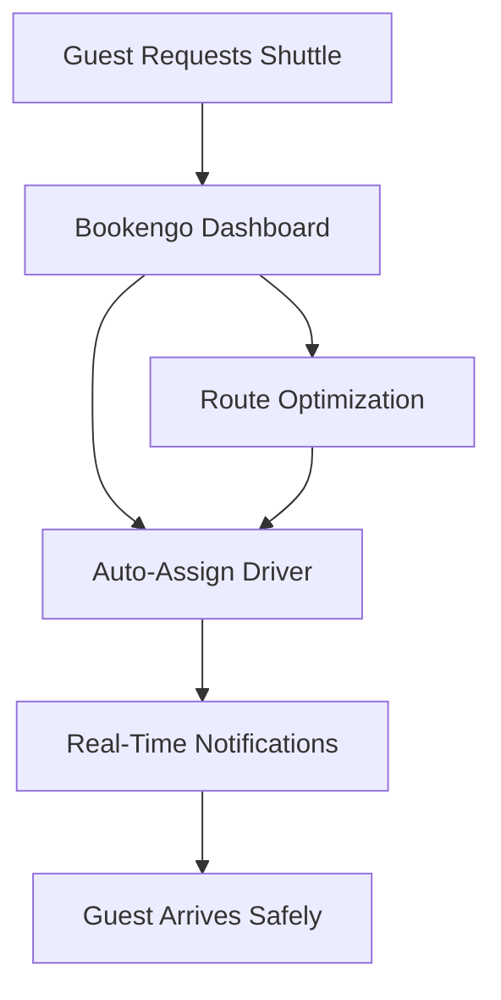

## Overview

Bookengo empowers hotel managers like you to handle shuttle reservations effortlessly. You streamline guest transportation, from airport pickups to city tours, all through an intuitive dashboard. Designed specifically for the hospitality industry, Bookengo integrates seamlessly with your existing systems, reducing manual work and boosting guest satisfaction.

<Callout kind="info">
Bookengo supports unlimited reservations and real-time tracking, perfect for high-volume hotels.
</Callout>

## Key Benefits

Bookengo delivers clear advantages for your hotel operations. You gain efficiency, happier guests, and better resource management.

<Columns cols={3}>
  <Card title="Effortless Reservations" icon="calendar" href="/docs/reservations">
    Create and manage shuttle bookings in seconds. Guests book directly via your hotel app or website.
  </Card>
  <Card title="Real-Time Tracking" icon="map-pin" href="/docs/tracking">
    Monitor shuttles live with GPS integration. Notify guests of delays instantly.
  </Card>
  <Card title="Cost Savings" icon="dollar-sign" href="/docs/pricing">
    Optimize routes and driver schedules to cut fuel and overtime expenses by up to 30%.
  </Card>
</Columns>

## How Bookengo Streamlines Operations

Bookengo automates the entire shuttle workflow. You set up routes once, and the system handles assignments, notifications, and reporting.



<Expandable title="Detailed Workflow" default-open="false">

1. Guests submit requests via your portal.
2. Bookengo matches availability using AI-driven scheduling.
3. Drivers receive mobile alerts with navigation.
4. Post-trip analytics help refine future operations.

</Expandable>

## Quick Start Guide

Get up and running in minutes. Follow these steps to launch your first shuttle service.

<Steps>
  <Step title="Sign Up" icon="user-plus">
    Create your free account at bookengo.com. Verify your hotel details like `Grand Plaza Hotel` and primary address.
  </Step>
  <Step title="Configure Routes" icon="map">
    Define common routes, such as airport transfers. Set pricing tiers for peak hours.
  </Step>
  <Step title="Integrate API" icon="code">
    Connect Bookengo to your hotel system.
    
    <CodeGroup tabs="JavaScript,Python">
      ```javascript
      const bookengo = new BookengoClient({ apiKey: 'your-api-key' });
      const reservation = await bookengo.createReservation({
        guestName: 'John Doe',
        pickup: 'JFK Airport',
        dropoff: 'Grand Plaza Hotel',
        time: '2024-10-15T14:00:00Z'
      });
      console.log(reservation.id);
      ```
      ```python
      import bookengo
      client = bookengo.Client(api_key='your-api-key')
      reservation = client.create_reservation(
          guest_name='John Doe',
          pickup='JFK Airport',
          dropoff='Grand Plaza Hotel',
          time='2024-10-15T14:00:00Z'
      )
      print(reservation.id)
      ```
    </CodeGroup>
  </Step>
  <Step title="Go Live" icon="rocket">
    Enable guest-facing booking widget on your site. Monitor your first trips from the dashboard.
  </Step>
</Steps>

## Platform Setup

Tailor Bookengo to your environment.

<Tabs>
  <Tab title="Web Dashboard" icon="globe">
    Access via any modern browser. Supports Chrome, Firefox, and Safari.
    
    | Feature | Benefit |
    |---------|---------|
    | Live Map | Track all shuttles |
    | Reports | Export daily analytics |
  </Tab>
  <Tab title="Mobile App" icon="smartphone">
    Download iOS/Android apps for drivers. Features offline mode and push notifications.
  </Tab>
</Tabs>

Bookengo transforms shuttle management into a seamless process, letting you focus on exceptional guest experiences.