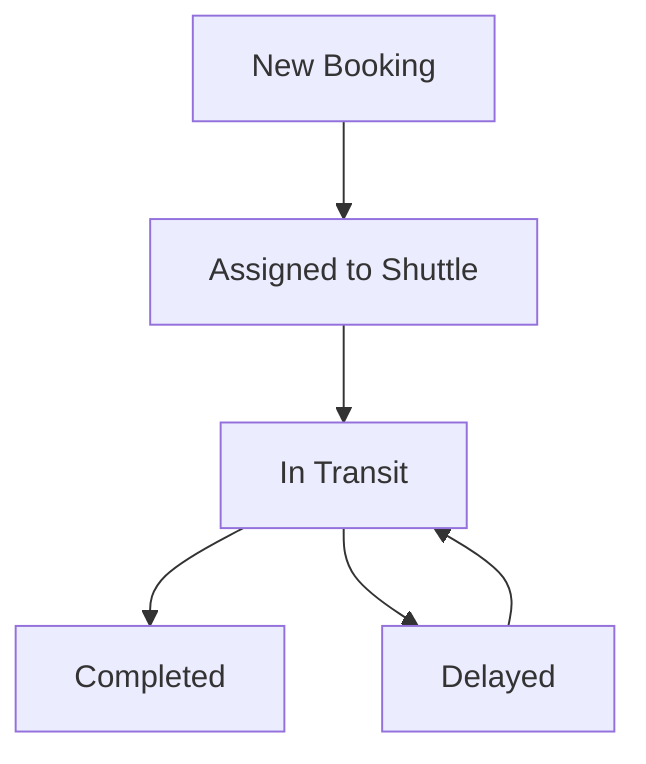

## Overview

Bookengo empowers you to manage shuttle reservations effortlessly for your hotel guests. You handle schedules, process bookings, and track statuses in real time to ensure smooth transportation. Follow these sections to get started and optimize operations.

<Columns cols={3}>
  <Card title="Schedules" icon="calendar" href="#managing-schedules">
    Set up and adjust shuttle timetables quickly.
  </Card>
  <Card title="Bookings" icon="user-plus" href="#handling-bookings">
    Accept and manage guest reservations seamlessly.
  </Card>
  <Card title="Status Tracking" icon="eye" href="#monitoring-status">
    Monitor live updates on all shuttles.
  </Card>
</Columns>

<Callout kind="tip">
  Log in to your Bookengo dashboard at `app.bookengo.com` using your hotel credentials to access all features.
</Callout>

## Managing Shuttle Schedules

Create and update shuttle schedules to match your hotel's needs. Use the dashboard to define routes, times, and capacity.

<Steps>
  <Step title="Access Schedules" icon="calendar">
    Navigate to the `Schedules` tab in the left sidebar.
  </Step>
  <Step title="Add New Schedule" icon="plus">
    Click `+ New Schedule` and enter details:
    
    | Field       | Example Value          |
    |-------------|------------------------|
    | Route       | Airport - Grand Plaza Hotel |
    | Departure   | 09:00 AM               |
    | Capacity    | 12 passengers          |
    | Frequency   | Daily                  |
  </Step>
  <Step title="Publish Changes" icon="check-circle">
    Review and click `Publish`. Schedules update instantly for guests.
  </Step>
</Steps>

<Expandable title="Advanced Scheduling Tips" default-open="false">
  For peak hours, set `maxBookings` to limit slots. Use recurring rules like `{ "days": ["mon", "wed", "fri"] }` in custom configs.
</Expandable>

## Handling Guest Bookings

Process incoming bookings from guests via web, app, or front desk. Confirm details and assign to available shuttles.

<Tabs>
  <Tab title="Web Dashboard" icon="globe">
    Review pending bookings in the `Bookings` section.
    
    <CodeGroup tabs="JSON View,List View">
    ```json
    {
      "guest": "Jane Smith",
      "room": "Suite 405",
      "pickup": "2024-10-15T14:00:00Z",
      "destination": "Downtown Convention Center",
      "seats": 2
    }
    ```
    ```markdown
    | Guest      | Time       | Status   |
    |------------|------------|----------|
    | Jane Smith | 2:00 PM   | Pending |
    ```
    </CodeGroup>
    
    Click `Approve` to confirm.
  </Tab>
  <Tab title="Mobile App" icon="smartphone">
    Scan guest QR code or enter room number to pull up bookings.
    
    Use quick actions: `Confirm`, `Cancel`, or `Reschedule`.
  </Tab>
</Tabs>

## Monitoring Reservation Status

Keep track of all active shuttles and bookings with real-time updates. Dashboards show delays, completions, and issues at a glance.



| Status     | Icon       | Action Needed              |
|------------|------------|----------------------------|
| Pending    | clock      | Review and approve         |
| In Transit | truck      | Monitor GPS location       |
| Completed  | check      | Mark as done, invoice      |
| Cancelled  | x          | Notify guest, free seats   |

<Callout kind="alert">
  Enable push notifications in `Settings > Notifications` for critical updates like delays `{>15 minutes}`.
</Callout>

This guide equips you to handle end-to-end shuttle management. For custom integrations, contact support@bookengo.com.